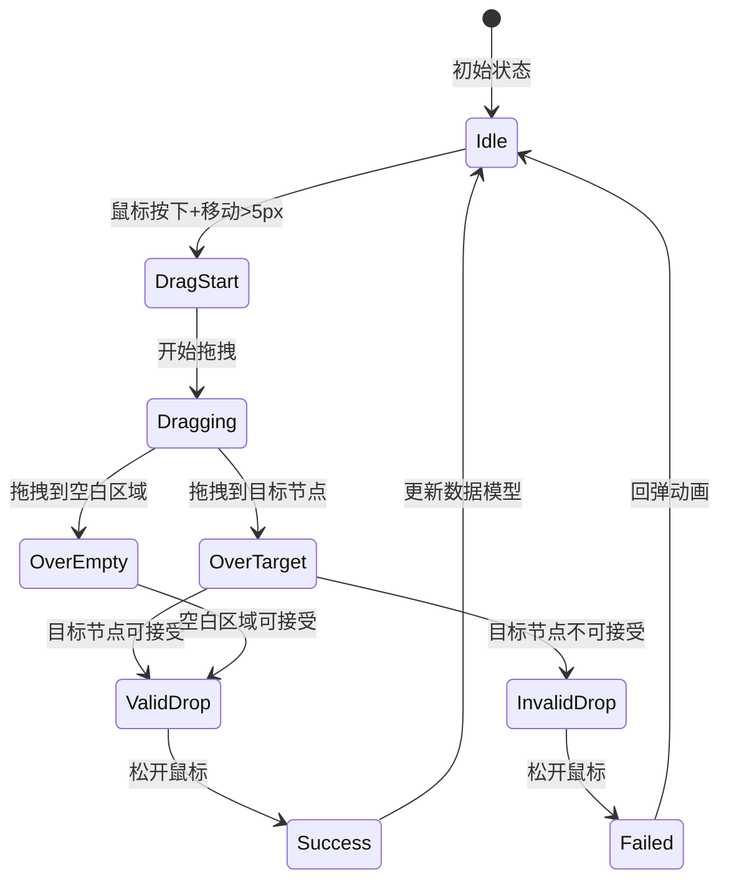
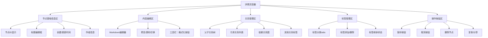
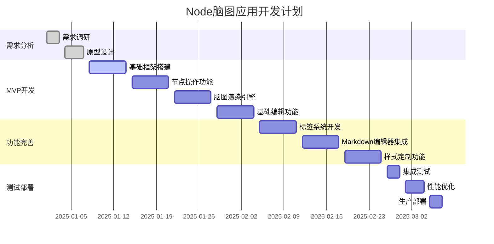

# Node脑图应用需求文档 v2.1

**项目代号：** MindNode  
**文档版本：** 2.1  
**创建日期：** 2025年01月  
**更新日期：** 2025年01月15日  
**负责团队：** 产品开发部  

---

## 1. 项目概述

### 1.1 项目背景
随着知识工作者对信息组织和可视化需求的增长，传统的线性笔记和文档已无法满足复杂思维过程的表达需求。脑图作为一种强大的可视化思维工具，能够帮助用户更好地组织、关联和理解信息。

这个脑图是作为一个独立的组件开发的，功能齐全，但是是工具，要被集成到其他的应用中。数据是拥有父子嵌套关系的MD文档。嵌套关系的描述是通过MD符号的约定；因此，这个工具要有一个父子关系的MD符号的约定；

要求：一个笔记块就是一个节点，笔记块的标题就是节点标题。
笔记块的规范后面有约定。

分隔符放在标记族之后：由标题。。。。标记族+分隔符,构成了MD的一个完整的笔记块。

### 1.2 笔记块数据规范

#### 1.2.1 基本格式结构

```
编号：{#唯一ID}
标题：笔记标题内容
时间：创建时间 | 更新时间  
作者：记录人

内容正文部分...
可以是多行内容
支持Markdown格式

---
【标记族】
父子关系：^父节点ID
引用关系：→引用节点ID1 →引用节点ID2
依赖关系：←依赖节点ID1 ←依赖节点ID2  
关联关系：↔关联节点ID1 ↔关联节点ID2
继承关系：↑继承源节点ID
对比关系：↕对比节点ID1 ↕对比节点ID2
冲突关系：✗冲突节点ID1 ✗冲突节点ID2
协作关系：&协作节点ID1 &协作节点ID2
分类标签：@大类.中类.小类.具体标签
业务标签：@业务分类标签
技术标签：@技术分类标签
状态标签：@状态分类标签
```


### 1.3 项目目标
开发一个基于Web的智能脑图组件，提供：
- 基于MD文档笔记块的节点可视化展示
- 智能解析MD文档中的关系符号和标记族
- 直观的节点操作和脑图构建体验
- 灵活的标签分类和内容管理系统
- 强大的Markdown编辑和阅读功能
- 高性能的大规模数据处理能力

### 1.4 项目范围
**包含范围：**
- Web端脑图组件库
- MD文档解析引擎
- 笔记块节点管理系统
- 关系符号解析系统
- 标签分类系统
- 组件集成接口

**不包含范围：**
- 移动端原生应用
- 实时多人协作功能
- 第三方平台集成
- MD文档存储管理（由宿主应用负责）

## 2. 用户分析

### 2.1 目标用户画像

#### 主要用户群体
1. **知识工作者** (40%)
   - 需要整理复杂的项目信息和知识体系
   - 重视信息的结构化和可视化
   
2. **学生群体** (30%)
   - 需要制作学习笔记和思维导图
   - 重视编辑的便捷性和内容的丰富性
   
3. **项目管理者** (20%)
   - 需要分解任务和跟踪项目进度
   - 重视数据的组织性和查找效率
   
4. **创意工作者** (10%)
   - 需要进行头脑风暴和创意整理
   - 重视界面的美观性和操作的流畅性

### 2.2 核心使用场景

#### 场景1：知识体系构建
**用户故事：** 作为一名产品经理，我希望能够构建完整的产品知识体系，包括市场分析、用户需求、功能设计等各个维度的内容，以便系统性地管理产品相关信息。

**关键需求：**
- 多层级节点结构
- 丰富的内容编辑能力
- 灵活的标签分类系统

#### 场景2：项目任务分解
**用户故事：** 作为一名项目经理，我希望能够将复杂项目分解为可管理的任务节点，并跟踪每个任务的状态和进度，以便更好地控制项目执行。

**关键需求：**
- 层级化任务分解
- 状态标签管理
- 进度可视化展示

#### 场景3：学习笔记整理
**用户故事：** 作为一名学生，我希望能够将课程内容以脑图形式整理，支持图片、公式、代码等多种内容类型，以便更好地理解和记忆知识点。

**关键需求：**
- Markdown内容支持
- 多媒体内容嵌入
- 快速节点创建和编辑

## 3. 功能需求

### 3.1 核心功能（MVP - 第一优先级）

#### 3.1.1 基础节点操作
**功能描述：** 提供完整的节点增删改查操作

**详细需求：**
- **节点创建**
  - Tab键添加子节点
  - Enter键添加同级节点
  - 右键菜单创建节点
  
- **节点编辑**
  - 双击直接编辑节点文本
  - 支持多行文本输入
  - 实时保存编辑内容
  
- **节点删除**
  - Delete键删除选中节点
  - 右键菜单删除选项
  - 递归删除所有子节点
  - 删除前确认对话框

- **节点拖拽与关系调整**
  - **拖拽移动功能**
    - 鼠标按住节点进行拖拽移动
    - 拖拽过程中显示半透明的节点预览
    - 实时显示可放置的目标区域高亮
    
  - **父子关系重建**
    - 拖拽节点到其他节点上方建立父子关系
    - 拖拽到目标节点时显示"成为子节点"的视觉提示
    - 拖拽到空白区域时恢复为根节点
    
  - **层级关系调整**
    - 支持跨层级拖拽（子节点可直接拖拽给祖父节点）
    - 拖拽时自动计算最适合的插入位置
    - 支持同级节点间的顺序调整
    
  - **拖拽约束与验证**
    - 禁止节点拖拽给自己的子节点（避免循环引用）
    - 拖拽前检测是否会产生循环依赖
    - 提供拖拽失败时的错误提示和回弹动画

**拖拽交互设计规范：**

```typescript
interface DragDropConfig {
  // 拖拽行为配置
  dragThreshold: number;              // 开始拖拽的最小移动距离（默认5px）
  dragOpacity: number;               // 拖拽时节点透明度（默认0.6）
  dropZoneHighlight: string;         // 可放置区域高亮颜色
  
  // 视觉反馈配置
  showDropPreview: boolean;          // 是否显示放置预览
  animationDuration: number;         // 动画持续时间（默认300ms）
  
  // 约束条件
  allowSelfDrop: boolean;           // 是否允许拖拽到自身（默认false）
  maxDragDistance: number;          // 最大拖拽距离限制
  
  // 拖拽状态回调
  onDragStart: (nodeId: string) => void;
  onDragOver: (nodeId: string, targetId?: string) => boolean;
  onDrop: (nodeId: string, targetId: string, position: DropPosition) => void;
  onDragEnd: (nodeId: string, success: boolean) => void;
}

type DropPosition = 'child' | 'before' | 'after' | 'root';
```

**拖拽状态机设计：**



**MD文档同步机制：**

```typescript
class NodeDragHandler {
  // 处理节点拖拽放置
  async handleNodeDrop(dragNodeId: string, dropTargetId: string, position: DropPosition): Promise<void> {
    // 1. 验证拖拽合法性
    if (!this.validateDrop(dragNodeId, dropTargetId)) {
      throw new Error('Invalid drop operation: circular dependency detected');
    }
    
    // 2. 更新内存数据模型
    const updatedTree = this.updateTreeStructure(dragNodeId, dropTargetId, position);
    
    // 3. 同步到MD文档
    const updatedMarkdown = await this.syncToMarkdown(updatedTree);
    
    // 4. 触发变更回调
    this.onStructureChange?.(updatedMarkdown);
    
    // 5. 重新计算布局
    this.refreshLayout();
  }
  
  // 验证拖拽操作的合法性
  private validateDrop(dragNodeId: string, dropTargetId: string): boolean {
    // 检查是否拖拽到自身
    if (dragNodeId === dropTargetId) {
      return false;
    }
    
    // 检查是否会形成循环依赖
    return !this.wouldCreateCycle(dragNodeId, dropTargetId);
  }
  
  // 检测循环依赖
  private wouldCreateCycle(dragNodeId: string, dropTargetId: string): boolean {
    const visited = new Set<string>();
    const queue = [dropTargetId];
    
    while (queue.length > 0) {
      const currentId = queue.shift()!;
      
      if (currentId === dragNodeId) {
        return true; // 发现循环
      }
      
      if (visited.has(currentId)) {
        continue;
      }
      
      visited.add(currentId);
      
      // 添加所有子节点到队列
      const children = this.getChildrenIds(currentId);
      queue.push(...children);
    }
    
    return false;
  }
  
  // 更新树结构
  private updateTreeStructure(dragNodeId: string, dropTargetId: string, position: DropPosition): MindMapTree {
    const tree = this.getCurrentTree();
    const dragNode = tree.nodes.get(dragNodeId);
    
    if (!dragNode) {
      throw new Error(`Node ${dragNodeId} not found`);
    }
    
    // 1. 从原位置移除
    this.removeFromOriginalPosition(tree, dragNodeId);
    
    // 2. 更新父子关系
    switch (position) {
      case 'child':
        dragNode.relations.parent = dropTargetId;
        this.addToHierarchy(tree, dropTargetId, dragNodeId);
        break;
        
      case 'root':
        dragNode.relations.parent = undefined;
        this.addToRootLevel(tree, dragNodeId);
        break;
        
      case 'before':
      case 'after':
        const targetParent = this.getParentId(dropTargetId);
        dragNode.relations.parent = targetParent;
        this.insertIntoSiblings(tree, dragNodeId, dropTargetId, position);
        break;
    }
    
    return tree;
  }
  
  // 同步到MD文档
  private async syncToMarkdown(tree: MindMapTree): Promise<string> {
    const markdownBuilder = new MarkdownBuilder();
    
    // 遍历树结构，重新生成MD文档
    const rootNodes = this.getRootNodes(tree);
    
    for (const rootId of rootNodes) {
      await this.buildMarkdownForSubtree(markdownBuilder, tree, rootId);
    }
    
    return markdownBuilder.toString();
  }
  
  // 为子树构建MD文档
  private async buildMarkdownForSubtree(builder: MarkdownBuilder, tree: MindMapTree, nodeId: string): Promise<void> {
    const node = tree.nodes.get(nodeId);
    if (!node) return;
    
    // 构建笔记块
    builder.addNoteBlock({
      id: node.id,
      title: node.title,
      content: node.content,
      author: node.author,
      createdAt: node.createdAt,
      updatedAt: new Date(), // 更新时间
      relations: node.relations,
      tags: node.tags
    });
    
    // 递归处理子节点
    const children = tree.relationships.hierarchy.get(nodeId) || [];
    for (const childId of children) {
      await this.buildMarkdownForSubtree(builder, tree, childId);
    }
  }
}
```

**拖拽视觉效果实现：**

```typescript
class DragVisualEffects {
  // 开始拖拽时的视觉效果
  startDragEffect(nodeElement: HTMLElement): void {
    // 1. 创建拖拽预览
    const dragPreview = nodeElement.cloneNode(true) as HTMLElement;
    dragPreview.style.opacity = '0.6';
    dragPreview.style.transform = 'scale(0.9)';
    dragPreview.style.pointerEvents = 'none';
    dragPreview.style.zIndex = '9999';
    
    // 2. 原节点添加拖拽状态样式
    nodeElement.classList.add('node-dragging');
    
    // 3. 显示所有可能的放置目标
    this.highlightDropTargets(nodeElement.dataset.nodeId!);
  }
  
  // 高亮可放置目标
  private highlightDropTargets(dragNodeId: string): void {
    const allNodes = document.querySelectorAll('.mind-map-node');
    
    allNodes.forEach(node => {
      const nodeId = node.getAttribute('data-node-id');
      
      if (nodeId && this.canDropOnTarget(dragNodeId, nodeId)) {
        node.classList.add('drop-target-valid');
      } else {
        node.classList.add('drop-target-invalid');
      }
    });
  }
  
  // 拖拽结束时的清理效果
  endDragEffect(success: boolean): void {
    // 清除所有拖拽相关样式
    document.querySelectorAll('.node-dragging').forEach(el => {
      el.classList.remove('node-dragging');
    });
    
    document.querySelectorAll('.drop-target-valid, .drop-target-invalid').forEach(el => {
      el.classList.remove('drop-target-valid', 'drop-target-invalid');
    });
    
    // 根据成功/失败播放不同动画
    if (success) {
      this.playSuccessAnimation();
    } else {
      this.playFailureAnimation();
    }
  }
}
```

**性能优化考虑：**

```typescript
interface DragPerformanceConfig {
  // 拖拽性能优化
  throttleInterval: number;          // 拖拽事件节流间隔（默认16ms）
  enableVirtualization: boolean;     // 大量节点时启用虚拟化
  maxHighlightNodes: number;         // 最大高亮节点数量限制
  
  // 布局更新优化
  deferLayoutUpdate: boolean;        // 延迟布局更新到拖拽结束
  batchUpdateThreshold: number;      // 批量更新阈值
}
```

**错误处理与用户反馈：**

```typescript
interface DragErrorHandling {
  // 错误类型定义
  errorTypes: {
    CIRCULAR_DEPENDENCY: '检测到循环依赖，无法完成此操作';
    INVALID_TARGET: '目标节点无法接受此拖拽操作';
    PERMISSION_DENIED: '没有权限修改此节点关系';
    NETWORK_ERROR: '网络错误，无法同步数据';
  };
  
  // 错误处理方法
  handleDragError(error: DragError): void {
    // 1. 显示错误提示
    this.showErrorToast(error.message);
    
    // 2. 回滚操作
    this.rollbackDragOperation();
    
    // 3. 记录错误日志
    this.logDragError(error);
  };
}
```

#### 3.1.2 脑图可视化渲染
**功能描述：** 提供清晰美观的脑图可视化展示

**详细需求：**
- 自动布局算法（层次布局）
- 节点连接线渲染
- 缩放和平移操作
- 节点展开/折叠功能

#### 3.1.3 基础内容编辑
**功能描述：** 支持节点内容的基础编辑功能

**详细需求：**
- 纯文本编辑
- 基础格式化（加粗、斜体）
- 简单的Markdown语法支持

#### 3.1.4 脑图与详情页联动系统
**功能描述：** 实现脑图节点与详情页的实时联动和数据同步

**核心交互流程：**
- **节点选择联动**
  - 点击脑图节点时，右侧详情页立即显示该节点的完整信息
  - 支持键盘导航选择节点（方向键 + Enter确认）
  - 选中状态有明显的视觉反馈（高亮边框、背景色变化）

- **详情页实时编辑**
  - 详情页内容修改时，脑图节点标题同步更新
  - 支持Markdown实时预览和源码编辑模式切换
  - 标签修改时，节点颜色和样式自动更新

- **双向数据绑定**
  - 脑图节点拖拽移动时，详情页关系信息自动更新
  - 详情页关系编辑时，脑图连接线实时重绘
  - 所有变更自动同步到底层MD文档

**详情页UI布局设计：**



**详情页功能规格：**

```typescript
interface NodeDetailPanel {
  // 基础信息显示
  nodeInfo: {
    id: string;                    // 节点ID（只读）
    title: string;                 // 可编辑标题
    author: string;               // 作者信息
    createdAt: Date;              // 创建时间（只读）
    updatedAt: Date;              // 更新时间（自动更新）
  };
  
  // 内容编辑器
  contentEditor: {
    mode: 'preview' | 'source' | 'split';  // 编辑模式
    content: string;                        // Markdown内容
    autoSave: boolean;                      // 自动保存开关
    saveInterval: number;                   // 自动保存间隔（秒）
  };
  
  // 关系管理
  relationshipManager: {
    parentNode?: NodeReference;             // 父节点
    childNodes: NodeReference[];            // 子节点列表
    references: NodeReference[];            // 引用节点
    dependencies: NodeReference[];          // 依赖节点
    associations: NodeReference[];          // 关联节点
  };
  
  // 标签系统
  tagManager: {
    categories: TagCategory[];              // 标签分类
    inheritedTags: Tag[];                  // 继承的标签
    ownTags: Tag[];                        // 自有标签
    inheritanceEnabled: boolean;           // 标签继承开关
  };
  
  // 事件处理
  events: {
    onContentChange: (content: string) => void;
    onTitleChange: (title: string) => void;
    onTagChange: (tags: Tag[]) => void;
    onRelationChange: (relations: Relations) => void;
    onSave: (nodeData: NoteBlock) => Promise<void>;
    onCancel: () => void;
    onDelete: (nodeId: string) => Promise<boolean>;
  };
}

interface NodeReference {
  id: string;
  title: string;
  onClick: () => void;                     // 点击跳转到该节点
}
```

**实时联动机制实现：**

```typescript
class MindMapDetailSync {
  private selectedNodeId: string | null = null;
  private detailPanel: NodeDetailPanel;
  private mindMapRenderer: MindMapRenderer;
  
  // 节点选择处理
  handleNodeSelection(nodeId: string): void {
    // 1. 更新选中状态
    this.selectedNodeId = nodeId;
    this.updateNodeSelection(nodeId);
    
    // 2. 加载节点详情到右侧面板
    const nodeData = this.loadNodeData(nodeId);
    this.detailPanel.loadNode(nodeData);
    
    // 3. 更新面板可见性
    this.detailPanel.show();
    
    // 4. 触发选择事件
    this.onNodeSelected?.(nodeId, nodeData);
  }
  
  // 详情页内容变更处理
  handleDetailChange(field: string, value: any): void {
    if (!this.selectedNodeId) return;
    
    // 1. 更新内存数据模型
    this.updateNodeField(this.selectedNodeId, field, value);
    
    // 2. 同步到脑图显示
    switch (field) {
      case 'title':
        this.mindMapRenderer.updateNodeTitle(this.selectedNodeId, value);
        break;
      case 'tags':
        this.mindMapRenderer.updateNodeStyle(this.selectedNodeId, this.calculateNodeStyle(value));
        break;
      case 'relations':
        this.mindMapRenderer.updateNodeRelations(this.selectedNodeId, value);
        break;
    }
    
    // 3. 标记为需要保存
    this.markAsModified(this.selectedNodeId);
    
    // 4. 触发自动保存（如果启用）
    if (this.detailPanel.contentEditor.autoSave) {
      this.scheduleAutoSave();
    }
  }
  
  // 脑图节点变更处理
  handleMindMapChange(nodeId: string, changeType: string, newValue: any): void {
    // 1. 更新数据模型
    this.updateNodeField(nodeId, changeType, newValue);
    
    // 2. 如果是当前选中节点，同步到详情页
    if (nodeId === this.selectedNodeId) {
      this.detailPanel.updateField(changeType, newValue);
    }
    
    // 3. 更新MD文档
    this.syncToMarkdown();
  }
  
  // 关系编辑处理
  handleRelationEdit(action: 'add' | 'remove', relationType: string, targetNodeId: string): void {
    if (!this.selectedNodeId) return;
    
    const sourceNode = this.getNode(this.selectedNodeId);
    
    switch (action) {
      case 'add':
        this.addRelation(this.selectedNodeId, targetNodeId, relationType);
        // 更新脑图连接线
        this.mindMapRenderer.addRelationLine(this.selectedNodeId, targetNodeId, relationType);
        break;
        
      case 'remove':
        this.removeRelation(this.selectedNodeId, targetNodeId, relationType);
        // 删除脑图连接线
        this.mindMapRenderer.removeRelationLine(this.selectedNodeId, targetNodeId, relationType);
        break;
    }
    
    // 更新详情页关系显示
    this.detailPanel.updateRelations(sourceNode.relations);
  }
  
  // 标签继承处理
  handleTagInheritance(parentNodeId: string, newTags: Tag[]): void {
    const childNodes = this.getChildNodes(parentNodeId);
    
    childNodes.forEach(childNode => {
      // 合并继承标签和自有标签
      const inheritedTags = newTags.filter(tag => tag.inheritable);
      const mergedTags = [...childNode.tags.ownTags, ...inheritedTags];
      
      // 更新子节点标签
      this.updateNodeField(childNode.id, 'tags', mergedTags);
      
      // 更新脑图显示
      this.mindMapRenderer.updateNodeStyle(childNode.id, this.calculateNodeStyle(mergedTags));
      
      // 如果子节点当前被选中，更新详情页
      if (childNode.id === this.selectedNodeId) {
        this.detailPanel.updateTags(mergedTags);
      }
      
      // 递归处理子节点的子节点
      this.handleTagInheritance(childNode.id, inheritedTags);
    });
  }
}
```

**详情页组件结构：**

```html
<!-- 详情页模板结构 -->
<div class="node-detail-panel" v-if="selectedNode">
  <!-- 头部信息区 -->
  <div class="detail-header">
    <div class="node-id">{{ selectedNode.id }}</div>
    <input 
      v-model="selectedNode.title" 
      @input="handleTitleChange"
      class="node-title-input"
      placeholder="节点标题..."
    />
    <div class="node-meta">
      <span>作者：{{ selectedNode.author }}</span>
      <span>创建：{{ formatDate(selectedNode.createdAt) }}</span>
      <span>更新：{{ formatDate(selectedNode.updatedAt) }}</span>
    </div>
  </div>
  
  <!-- 内容编辑区 -->
  <div class="detail-content">
    <div class="editor-toolbar">
      <button 
        v-for="mode in editorModes" 
        :key="mode"
        :class="{ active: currentMode === mode }"
        @click="switchEditorMode(mode)"
      >
        {{ mode }}
      </button>
    </div>
    
    <div class="editor-container">
      <!-- Markdown编辑器 -->
      <markdown-editor
        v-if="currentMode === 'source'"
        v-model="selectedNode.content"
        @input="handleContentChange"
        :auto-save="autoSaveEnabled"
      />
      
      <!-- 预览模式 -->
      <markdown-preview
        v-if="currentMode === 'preview'"
        :content="selectedNode.content"
      />
      
      <!-- 分割模式 -->
      <split-editor
        v-if="currentMode === 'split'"
        v-model="selectedNode.content"
        @input="handleContentChange"
      />
    </div>
  </div>
  
  <!-- 关系管理区 -->
  <div class="detail-relations">
    <el-tabs v-model="activeRelationTab">
      <el-tab-pane label="层级关系" name="hierarchy">
        <div class="parent-node" v-if="selectedNode.relations.parent">
          <span>父节点：</span>
          <node-link 
            :node-id="selectedNode.relations.parent"
            @click="selectNode"
          />
        </div>
        <div class="child-nodes" v-if="childNodes.length > 0">
          <span>子节点：</span>
          <node-link
            v-for="childId in childNodes"
            :key="childId"
            :node-id="childId"
            @click="selectNode"
          />
        </div>
      </el-tab-pane>
      
      <el-tab-pane label="引用关系" name="references">
        <relation-list
          :relations="selectedNode.relations.references"
          type="引用"
          @add="addRelation"
          @remove="removeRelation"
          @click="selectNode"
        />
      </el-tab-pane>
      
      <el-tab-pane label="依赖关系" name="dependencies">
        <relation-list
          :relations="selectedNode.relations.dependencies"
          type="依赖"
          @add="addRelation"
          @remove="removeRelation"
          @click="selectNode"
        />
      </el-tab-pane>
      
      <el-tab-pane label="其他关系" name="others">
        <div v-for="(relations, type) in otherRelations" :key="type">
          <relation-list
            :relations="relations"
            :type="type"
            @add="addRelation"
            @remove="removeRelation"
            @click="selectNode"
          />
        </div>
      </el-tab-pane>
    </el-tabs>
  </div>
  
  <!-- 标签管理区 -->
  <div class="detail-tags">
    <el-tabs v-model="activeTagTab">
      <el-tab-pane 
        v-for="category in tagCategories" 
        :key="category.name"
        :label="category.label" 
        :name="category.name"
      >
        <tag-manager
          :tags="getTagsByCategory(category.name)"
          :inherited-tags="getInheritedTags(category.name)"
          :category="category.name"
          @add="addTag"
          @remove="removeTag"
          @toggle-inheritance="toggleTagInheritance"
        />
      </el-tab-pane>
    </el-tabs>
  </div>
  
  <!-- 操作按钮区 -->
  <div class="detail-actions">
    <el-button-group>
      <el-button 
        type="primary" 
        @click="saveNode"
        :disabled="!hasChanges"
      >
        保存
      </el-button>
      <el-button @click="cancelEdit">取消</el-button>
      <el-button 
        type="danger" 
        @click="deleteNode"
        :disabled="!canDelete"
      >
        删除
      </el-button>
    </el-button-group>
    
    <el-dropdown>
      <el-button>
        更多操作<i class="el-icon-arrow-down el-icon--right"></i>
      </el-button>
      <el-dropdown-menu slot="dropdown">
        <el-dropdown-item @click="duplicateNode">复制节点</el-dropdown-item>
        <el-dropdown-item @click="exportNode">导出节点</el-dropdown-item>
        <el-dropdown-item @click="shareNode">分享节点</el-dropdown-item>
        <el-dropdown-item divided @click="viewHistory">查看历史</el-dropdown-item>
      </el-dropdown-menu>
    </el-dropdown>
  </div>
</div>
```

**样式和交互效果：**

```css
/* 详情页样式 */
.node-detail-panel {
  width: 400px;
  height: 100%;
  background: #fff;
  border-left: 1px solid #e0e0e0;
  display: flex;
  flex-direction: column;
  overflow: hidden;
}

.detail-header {
  padding: 16px;
  border-bottom: 1px solid #e0e0e0;
  background: #f5f5f5;
}

.node-title-input {
  width: 100%;
  font-size: 18px;
  font-weight: bold;
  border: none;
  background: transparent;
  outline: none;
  margin: 8px 0;
}

.node-title-input:focus {
  background: #fff;
  border: 1px solid #409eff;
  border-radius: 4px;
  padding: 4px 8px;
}

.detail-content {
  flex: 1;
  display: flex;
  flex-direction: column;
  overflow: hidden;
}

.editor-container {
  flex: 1;
  overflow: auto;
}

.detail-relations,
.detail-tags {
  max-height: 200px;
  overflow: auto;
  border-top: 1px solid #e0e0e0;
}

.detail-actions {
  padding: 16px;
  border-top: 1px solid #e0e0e0;
  display: flex;
  justify-content: space-between;
  align-items: center;
}

/* 节点选中状态 */
.mind-map-node.selected {
  stroke: #409eff;
  stroke-width: 3px;
  box-shadow: 0 0 10px rgba(64, 158, 255, 0.3);
}

/* 联动动画效果 */
.detail-panel-enter-active,
.detail-panel-leave-active {
  transition: transform 0.3s ease;
}

.detail-panel-enter,
.detail-panel-leave-to {
  transform: translateX(100%);
}
```

**数据同步性能优化：**

```typescript
class SyncOptimizer {
  private syncQueue: SyncOperation[] = [];
  private syncTimer: number | null = null;
  private readonly SYNC_DELAY = 300; // 防抖延迟
  
  // 防抖同步
  debouncedSync(operation: SyncOperation): void {
    this.syncQueue.push(operation);
    
    if (this.syncTimer) {
      clearTimeout(this.syncTimer);
    }
    
    this.syncTimer = setTimeout(() => {
      this.executeBatchSync();
    }, this.SYNC_DELAY);
  }
  
  // 批量执行同步操作
  private executeBatchSync(): void {
    const operations = [...this.syncQueue];
    this.syncQueue = [];
    
    // 合并相同节点的操作
    const mergedOps = this.mergeOperations(operations);
    
    // 执行同步
    mergedOps.forEach(op => {
      this.executeSync(op);
    });
  }
}
```

### 3.2 重要功能（第二优先级）

#### 3.2.1 高级标签系统
**功能描述：** 提供灵活的多维度标签分类系统

**技术实现：**
```javascript
// 标签数据结构
const tagSchema = {
  id: String,
  name: String,
  color: String,
  category: String, // 'topic', 'status', 'priority'
  parentId: String,
  level: Number
}
```

**详细需求：**
- 分面标签结构（主题、状态、优先级）
- 层级标签关系管理
- 标签自动补全和推荐
- 按标签筛选和高亮显示

#### 3.2.2 Markdown详情页编辑器
**功能描述：** 提供强大的Markdown编辑和预览功能

**详细需求：**
- 所见即所得编辑器
- Markdown源码模式
- 实时预览功能
- 语法高亮支持
- 表格、代码块、数学公式支持

#### 3.2.3 节点样式定制
**功能描述：** 允许用户自定义节点的视觉样式

**详细需求：**
- 节点颜色设置
- 字体样式调整
- 边框样式选择
- 形状模板选择

### 3.3 增强功能（第三优先级）

#### 3.3.1 批量操作
- 多选节点功能
- 批量删除操作
- 批量样式设置
- 批量标签管理

#### 3.3.2 数据导入导出
- JSON格式导出
- Markdown文件导出
- FreeMind格式兼容
- 数据备份和恢复

#### 3.3.3 搜索和过滤
- 全文搜索功能
- 标签过滤器
- 内容类型过滤
- 搜索结果高亮

## 4. 系统架构设计

### 4.1 纯前端架构总览

本系统采用**纯前端架构设计**，专注于本地部署和组件化集成：
- **组件化设计**：可独立运行的脑图组件，支持集成到任何Web应用
- **本地处理**：所有数据解析和渲染都在浏览器端完成
- **无服务器依赖**：纯静态文件部署，无需后端服务

```mermaid
graph TB
    subgraph "宿主应用环境"
        A[Vue/React/原生JS应用] --> B[MindMap组件]
    end
    
    subgraph "脑图组件核心"
        B --> C[MD文档解析引擎]
    B --> D[脑图渲染引擎]
        B --> E[交互控制系统]
        B --> F[数据管理层]
        
        C --> C1[marked.js解析器]
        C --> C2[笔记块提取器]
        C --> C3[关系符号解析器]
        C --> C4[标记族解析器]
        
        D --> D1[D3.js渲染器]
        D --> D2[Canvas渲染器(可选)]
    D --> D3[布局算法引擎]
        D --> D4[关系线渲染器]
        
        E --> E1[节点操作控制器]
        E --> E2[拖拽交互处理器]
        E --> E3[编辑器集成控制器]
        E --> E4[键盘快捷键处理器]
        
        F --> F1[内存数据模型]
        F --> F2[本地缓存管理]
        F --> F3[数据变更同步]
    end
    
    subgraph "渲染输出"
        G[HTML DOM结构]
        H[SVG/Canvas图形]
        I[CSS样式系统]
    end
    
    D1 --> G
    D1 --> H
    E --> I
    
    subgraph "数据源"
        J[MD文档内容]
        K[配置参数]
        L[样式主题]
    end
    
    A --> J
    A --> K
    A --> L
```

### 4.2 技术栈配置

#### 4.2.1 核心技术栈
| 技术层面 | 技术选型 | 版本要求 | 用途 |
|---------|---------|----------|------|
| **组件核心** | 原生JavaScript (ES6+) | ES2018+ | 组件逻辑，无框架依赖 |
| **图形渲染** | D3.js | v7.x | 专业的数据可视化和图形渲染 |
| **MD解析** | marked.js | v4.x | 标准Markdown解析 |
| **样式系统** | 原生CSS3 | - | 组件样式和动画效果 |
| **模块化** | ES Modules | ES2018 | 代码组织和依赖管理 |
| **打包工具** | Rollup | v3.x | 组件库打包和优化 |

#### 4.2.2 可选增强技术
| 技术层面 | 技术选型 | 用途 | 集成方式 |
|---------|---------|------|----------|
| **高性能渲染** | Canvas API | 大数据量渲染优化 | 可选渲染引擎 |
| **动画库** | GSAP (可选) | 高级动画效果 | CDN引入 |
| **工具库** | lodash-es (可选) | 数据处理工具函数 | 按需引入 |
| **图标库** | Feather Icons | UI图标 | SVG引入 |

#### 4.2.3 开发工具链
| 工具类型 | 技术选型 | 用途 |
|---------|---------|------|
| **代码质量** | ESLint + Prettier | 代码规范和格式化 |
| **类型检查** | JSDoc + TypeScript(可选) | 类型提示和文档 |
| **测试框架** | Jest + Testing Library | 单元测试和集成测试 |
| **文档生成** | JSDoc | API文档自动生成 |

### 4.3 核心数据模型设计

#### 4.3.1 笔记块数据模型
```javascript
/**
 * 笔记块数据结构
 * @typedef {Object} NoteBlock
 * @property {string} id - 唯一ID，如 N158
 * @property {string} title - 笔记标题
 * @property {string} content - Markdown内容
 * @property {string} author - 作者
 * @property {Date} createdAt - 创建时间
 * @property {Date} updatedAt - 更新时间
 * @property {Relations} relations - 关系数据
 * @property {Tags} tags - 标签数据
 * @property {Visualization} visualization - 可视化属性
 * @property {string} rawMarkdown - 原始MD文本
 */

/**
 * 关系数据结构
 * @typedef {Object} Relations
 * @property {string|null} parent - 父节点ID
 * @property {string[]} references - 引用关系节点ID列表
 * @property {string[]} dependencies - 依赖关系节点ID列表
 * @property {string[]} associations - 关联关系节点ID列表
 * @property {string|null} inheritance - 继承源节点ID
 * @property {string[]} comparisons - 对比关系节点ID列表
 * @property {string[]} conflicts - 冲突关系节点ID列表
 * @property {string[]} collaborations - 协作关系节点ID列表
 */

/**
 * 标签数据结构
 * @typedef {Object} Tags
 * @property {string[]} categories - 分类标签
 * @property {string[]} business - 业务标签
 * @property {string[]} technical - 技术标签
 * @property {string[]} status - 状态标签
 * @property {string[]} project - 项目标签
 * @property {string[]} team - 团队标签
 * @property {string[]} timeline - 时间标签
 * @property {string[]} complexity - 复杂度标签
 */
```

#### 4.3.2 脑图树数据模型
```javascript
/**
 * 脑图树数据结构
 * @typedef {Object} MindMapTree
 * @property {string} rootNode - 根节点ID
 * @property {Map<string, NoteBlock>} nodes - 所有节点映射
 * @property {RelationshipMaps} relationships - 关系映射
 * @property {Map<string, string[]>} tagIndex - 标签索引
 * @property {TreeMetadata} metadata - 元数据
 */

/**
 * 关系映射数据结构
 * @typedef {Object} RelationshipMaps
 * @property {Map<string, string[]>} hierarchy - 层级关系（父->子）
 * @property {Map<string, string[]>} references - 引用关系
 * @property {Map<string, string[]>} dependencies - 依赖关系
 * @property {Map<string, string[]>} associations - 关联关系
 */
```

### 4.4 组件架构设计

#### 4.4.1 组件接口设计
```javascript
/**
 * 脑图组件主类
 * @class MindMapComponent
 */
class MindMapComponent {
  /**
   * @param {HTMLElement} container - 容器元素
   * @param {ComponentOptions} options - 配置选项
   */
  constructor(container, options = {}) {
    this.container = container;
    this.options = this.mergeDefaultOptions(options);
    this.data = null;
    this.renderer = null;
    this.parser = null;
    this.interactionController = null;
    
    this.init();
  }
  
  /**
   * 组件配置选项
   * @typedef {Object} ComponentOptions
   * @property {string} theme - 主题 ('light' | 'dark')
   * @property {string} layout - 布局算法 ('hierarchical' | 'radial' | 'force')
   * @property {boolean} editable - 是否可编辑
   * @property {boolean} showMinimap - 是否显示缩略图
   * @property {RelationSymbolConfig} symbolConfig - 关系符号配置
   * @property {RenderConfig} renderConfig - 渲染配置
   * @property {InteractionConfig} interactionConfig - 交互配置
   */
  
  // 公共API方法
  loadMarkdown(markdownContent) { /* 加载MD内容 */ }
  exportData(format) { /* 导出数据 */ }
  fitToView() { /* 适应视图 */ }
  zoomTo(scale) { /* 缩放到指定比例 */ }
  selectNode(nodeId) { /* 选择节点 */ }
  expandNode(nodeId) { /* 展开节点 */ }
  collapseNode(nodeId) { /* 折叠节点 */ }
  
  // 事件回调
  onNodeClick(callback) { /* 节点点击事件 */ }
  onNodeEdit(callback) { /* 节点编辑事件 */ }
  onStructureChange(callback) { /* 结构变更事件 */ }
}
```

#### 4.4.2 模块化架构
```javascript
// 核心模块划分
const MindMapModules = {
  // 解析器模块
  Parser: {
    MarkdownParser: '处理标准MD解析',
    NoteBlockParser: '处理笔记块解析',
    RelationParser: '处理关系符号解析',
    TagParser: '处理标签解析'
  },
  
  // 渲染器模块
  Renderer: {
    D3Renderer: 'D3.js渲染引擎',
    CanvasRenderer: 'Canvas渲染引擎(可选)',
    LayoutEngine: '布局算法引擎',
    ThemeManager: '主题管理器'
  },
  
  // 交互模块
  Interaction: {
    NodeController: '节点操作控制器',
    DragController: '拖拽控制器',
    EditController: '编辑控制器',
    KeyboardController: '键盘控制器'
  },
  
  // 数据模块
  Data: {
    DataModel: '数据模型管理',
    CacheManager: '缓存管理',
    EventBus: '事件总线',
    Validator: '数据验证器'
  }
};
```

### 4.5 关键算法实现

#### 4.5.1 MD文档解析算法
```javascript
class MarkdownDocumentParser {
  /**
   * 解析MD文档为脑图数据
   * @param {string} markdown - MD文档内容
   * @returns {MindMapTree} 脑图树数据
   */
  parseDocument(markdown) {
    // 1. 分割笔记块
    const noteBlocks = this.splitIntoNoteBlocks(markdown);
    
    // 2. 解析每个笔记块
    const parsedBlocks = noteBlocks.map(block => this.parseNoteBlock(block));
    
    // 3. 构建关系映射
    const relationshipMaps = this.buildRelationshipMaps(parsedBlocks);
    
    // 4. 确定根节点
    const rootNode = this.findRootNode(parsedBlocks, relationshipMaps.hierarchy);
    
    // 5. 构建标签索引
    const tagIndex = this.buildTagIndex(parsedBlocks);
    
    return {
      rootNode,
      nodes: new Map(parsedBlocks.map(block => [block.id, block])),
      relationships: relationshipMaps,
      tagIndex,
      metadata: {
        totalNodes: parsedBlocks.length,
        lastModified: new Date(),
        version: '1.0'
      }
    };
  }
  
  /**
   * 分割MD文档为笔记块
   * @param {string} markdown - MD文档内容
   * @returns {string[]} 笔记块文本数组
   */
  splitIntoNoteBlocks(markdown) {
    // 按分隔符分割：编号：{#ID} 开始的块
    const blockPattern = /(?=^编号：\{#[^}]+\})/gm;
    return markdown.split(blockPattern).filter(block => block.trim().length > 0);
  }
  
  /**
   * 解析单个笔记块
   * @param {string} blockText - 笔记块文本
   * @returns {NoteBlock} 解析后的笔记块数据
   */
  parseNoteBlock(blockText) {
    const metadata = this.extractMetadata(blockText);
    const content = this.extractContent(blockText);
    const relations = this.parseRelations(blockText);
    const tags = this.parseTags(blockText);
    
    return {
      ...metadata,
      content,
      relations,
      tags,
      visualization: this.getDefaultVisualization(),
      rawMarkdown: blockText
    };
  }
}
```

#### 4.5.2 布局算法实现
```javascript
class LayoutEngine {
  /**
   * 计算节点布局
   * @param {MindMapTree} tree - 脑图树数据
   * @param {string} layoutType - 布局类型
   * @returns {Map<string, {x: number, y: number}>} 节点位置映射
   */
  calculateLayout(tree, layoutType = 'hierarchical') {
    switch (layoutType) {
      case 'hierarchical':
        return this.calculateHierarchicalLayout(tree);
      case 'radial':
        return this.calculateRadialLayout(tree);
      case 'force':
        return this.calculateForceLayout(tree);
      default:
        return this.calculateHierarchicalLayout(tree);
    }
  }
  
  /**
   * 层次布局算法
   * @param {MindMapTree} tree - 脑图树数据
   * @returns {Map<string, {x: number, y: number}>} 节点位置映射
   */
  calculateHierarchicalLayout(tree) {
    const positions = new Map();
    const levelNodes = new Map();
    
    // 1. 计算每个节点的层级
    this.calculateNodeLevels(tree, levelNodes);
    
    // 2. 为每个层级的节点分配位置
    levelNodes.forEach((nodes, level) => {
      const nodeSpacing = 200; // 节点间距
      const levelHeight = 150; // 层级间距
      const startX = -(nodes.length - 1) * nodeSpacing / 2; // 水平居中
      
      nodes.forEach((nodeId, index) => {
        positions.set(nodeId, {
          x: startX + index * nodeSpacing,
          y: level * levelHeight
        });
      });
    });
    
    return positions;
  }
  
  /**
   * 力导向布局算法
   * @param {MindMapTree} tree - 脑图树数据
   * @returns {Map<string, {x: number, y: number}>} 节点位置映射
   */
  calculateForceLayout(tree) {
    // 使用D3.js力模拟
    const nodes = Array.from(tree.nodes.values()).map(node => ({
      id: node.id,
      x: Math.random() * 800,
      y: Math.random() * 600
    }));
    
    const links = [];
    tree.relationships.hierarchy.forEach((children, parentId) => {
      children.forEach(childId => {
        links.push({ source: parentId, target: childId });
      });
    });
    
    // D3.js力模拟计算
    const simulation = d3.forceSimulation(nodes)
      .force('link', d3.forceLink(links).id(d => d.id))
      .force('charge', d3.forceManyBody().strength(-300))
      .force('center', d3.forceCenter(400, 300));
    
    // 运行模拟
    simulation.tick(300);
    
    const positions = new Map();
    nodes.forEach(node => {
      positions.set(node.id, { x: node.x, y: node.y });
    });
    
    return positions;
  }
}
```

### 4.6 部署配置

#### 4.6.1 文件结构
```
dist/
├── mindmap.js              # 主组件文件 (UMD格式)
├── mindmap.esm.js          # ES Module格式
├── mindmap.css             # 组件样式
├── mindmap.min.js          # 压缩版本
├── examples/               # 使用示例
│   ├── vanilla.html        # 原生JS示例
│   ├── vue.html           # Vue.js示例
│   └── react.html         # React示例
└── docs/                  # API文档
    ├── api.md
    └── examples.md
```

#### 4.6.2 使用方式
```html
<!-- 方式1: CDN引入 -->
<script src="https://unpkg.com/d3@7"></script>
<script src="https://unpkg.com/marked@4"></script>
<script src="./dist/mindmap.min.js"></script>
<link rel="stylesheet" href="./dist/mindmap.css">

<!-- 方式2: ES Module -->
<script type="module">
  import MindMapComponent from './dist/mindmap.esm.js';
</script>

<!-- 方式3: CommonJS (Node.js环境) -->
<script>
  const MindMapComponent = require('./dist/mindmap.js');
</script>
```

## 5. 技术实现方案

### 5.1 纯前端技术栈选择

| 技术层面 | 技术选型 | 选择理由 | 部署方式 |
|---------|---------|----------|----------|
| **前端框架** | 原生JavaScript (ES6+) | 无框架依赖，轻量级，兼容性强 | 静态文件 |
| **脑图渲染** | D3.js v7.x | 专业图可视化库，性能优秀，功能丰富 | CDN引入 |
| **MD解析** | marked.js v4.x | 成熟的MD解析库，支持扩展 | CDN引入 |
| **状态管理** | 原生EventTarget | 轻量级事件系统，无依赖 | 本地实现 |
| **样式系统** | 原生CSS3 + CSS变量 | 高性能，支持主题切换 | 内联样式 |
| **模块化** | ES Modules | 标准模块化方案 | 浏览器原生支持 |
| **组件打包** | Rollup v3.x | 现代打包工具，tree-shaking优秀 | 开发工具 |
| **类型检查** | JSDoc注释 | 无编译步骤，IDE支持好 | 开发时检查 |

### 5.2 核心依赖库配置

#### 5.2.1 D3.js 图形渲染配置
```javascript
// D3.js 核心模块使用
const d3Modules = {
  "d3-selection": "DOM选择和操作",
  "d3-hierarchy": "树形数据结构处理", 
  "d3-force": "力导向布局算法",
  "d3-zoom": "缩放和平移交互",
  "d3-drag": "拖拽交互",
  "d3-transition": "动画过渡效果",
  "d3-ease": "缓动函数"
};

// CDN配置
const d3Config = {
  url: "https://unpkg.com/d3@7.8.5/dist/d3.min.js",
  fallback: "./libs/d3.min.js"
};
```

#### 5.2.2 marked.js MD解析配置
```javascript
// marked.js 配置
const markedConfig = {
  options: {
    headerIds: false,
    mangle: false,
    sanitize: false,
    gfm: true,
    breaks: true
  },
  
  // 自定义渲染器
  customRenderer: {
    code: (code, language) => {
      return `<pre><code class="language-${language}">${code}</code></pre>`;
    },
    link: (href, title, text) => {
      const target = href.startsWith('#') ? '' : 'target="_blank"';
      return `<a href="${href}" ${target} title="${title || ''}">${text}</a>`;
    }
  }
};
```

### 5.3 组件主类设计

```javascript
/**
 * 脑图组件主类 - 纯前端实现
 * @class MindMapComponent
 */
class MindMapComponent extends EventTarget {
  constructor(container, options = {}) {
    super();
    
    this.container = container;
    this.options = this.mergeDefaultOptions(options);
    this.data = null;
    
    // 核心模块
    this.parser = new MDDocumentParser();
    this.renderer = new D3MindMapRenderer(container);
    this.layoutEngine = new LayoutEngine();
    this.interactionController = new InteractionController(this);
    
    this.init();
  }
  
  // 默认配置
  getDefaultOptions() {
    return {
      theme: 'light',
      layout: 'hierarchical',
      editable: true,
      symbolConfig: {
        parent: '^',
        reference: '→',
        dependency: '←',
        association: '↔',
        inheritance: '↑',
        comparison: '↕',
        conflict: '✗',
        collaboration: '&'
      },
      renderConfig: {
        nodeWidth: 200,
        nodeHeight: 60,
        nodeSpacing: 100,
        levelHeight: 120
      }
    };
  }
  
  // 公共API
  async loadMarkdown(markdownContent) {
    this.data = this.parser.parseDocument(markdownContent);
    const positions = this.layoutEngine.calculateLayout(this.data, this.options.layout);
    await this.renderer.render(this.data, positions);
    this.fitToView();
  }
  
  exportData(format = 'json') {
    switch (format) {
      case 'json': return JSON.stringify(this.data, null, 2);
      case 'markdown': return this.generateMarkdown();
      case 'svg': return this.renderer.exportSVG();
      default: throw new Error(`不支持的格式: ${format}`);
    }
  }
  
  selectNode(nodeId) { this.interactionController.selectNode(nodeId); }
  fitToView() { this.renderer.fitToView(); }
  zoomTo(scale) { this.renderer.zoomTo(scale); }
  changeLayout(layout) {
    const positions = this.layoutEngine.calculateLayout(this.data, layout);
    this.renderer.updateLayout(positions);
  }
  
  destroy() {
    this.interactionController.destroy();
    this.renderer.destroy();
    this.container.innerHTML = '';
  }
}
```

### 5.4 部署文件结构

```
mindmap-component/
├── dist/                          # 打包输出
│   ├── mindmap.js                 # UMD格式
│   ├── mindmap.esm.js             # ES Module格式  
│   ├── mindmap.min.js             # 压缩版本
│   ├── mindmap.css                # 样式文件
│   └── mindmap.min.css            # 压缩样式
├── examples/                      # 使用示例
│   ├── basic.html                 # 基础示例
│   ├── vue-integration.html       # Vue集成示例
│   └── react-integration.html     # React集成示例
├── docs/                          # 文档
│   ├── api.md                     # API文档
│   └── guide.md                   # 使用指南
└── README.md                      # 项目说明
```

### 5.5 使用方式

#### 5.5.1 CDN引入方式（推荐）
```html
<!DOCTYPE html>
<html>
<head>
    <meta charset="UTF-8">
    <title>脑图组件示例</title>
    
    <!-- 依赖库 -->
    <script src="https://unpkg.com/d3@7.8.5/dist/d3.min.js"></script>
    <script src="https://unpkg.com/marked@4.3.0/marked.min.js"></script>
    
    <!-- 脑图组件 -->
    <script src="./dist/mindmap.min.js"></script>
    <link rel="stylesheet" href="./dist/mindmap.min.css">
</head>
<body>
    <div id="mindmap-container" style="width: 100%; height: 600px;"></div>
    
    <script>
        const container = document.getElementById('mindmap-container');
        const mindmap = new MindMapComponent(container, {
            theme: 'light',
            layout: 'hierarchical',
            editable: true
        });
        
        const markdownContent = `
编号：{#N001}
标题：项目根节点
时间：2025-01-15 09:00:00 | 2025-01-15 09:00:00
作者：开发者

这是项目的根节点说明。

---
【标记族】
分类标签：@项目.根节点
状态标签：@进行中
        `;
        
        mindmap.loadMarkdown(markdownContent);
    </script>
</body>
</html>
```

#### 5.5.2 ES Module引入
```javascript
import MindMapComponent from './dist/mindmap.esm.js';
import './dist/mindmap.css';

const mindmap = new MindMapComponent(container, options);
```

#### 5.5.3 Vue.js集成
```vue
<template>
  <div ref="mindmapContainer" class="mindmap-wrapper"></div>
</template>

<script>
import MindMapComponent from './dist/mindmap.esm.js';

export default {
  name: 'MindMapWrapper',
  props: ['markdownContent', 'options'],
  mounted() {
    this.mindmap = new MindMapComponent(this.$refs.mindmapContainer, this.options);
    if (this.markdownContent) {
      this.mindmap.loadMarkdown(this.markdownContent);
    }
  },
  beforeUnmount() {
    this.mindmap?.destroy();
  }
};
</script>
```

#### 5.5.4 React集成
```jsx
import React, { useEffect, useRef } from 'react';
import MindMapComponent from './dist/mindmap.esm.js';

function MindMapWrapper({ markdownContent, options }) {
  const containerRef = useRef(null);
  const mindmapRef = useRef(null);
  
  useEffect(() => {
    if (containerRef.current) {
      mindmapRef.current = new MindMapComponent(containerRef.current, options);
    }
    
    return () => {
      mindmapRef.current?.destroy();
    };
  }, []);
  
  useEffect(() => {
    if (markdownContent && mindmapRef.current) {
      mindmapRef.current.loadMarkdown(markdownContent);
    }
  }, [markdownContent]);
  
  return <div ref={containerRef} className="mindmap-wrapper" />;
}
```

### 5.6 性能优化策略

#### 5.6.1 渲染性能优化
- **虚拟化渲染**：大数据量时只渲染可视区域节点
- **Canvas降级**：超过1000节点时自动切换到Canvas渲染
- **动画节流**：限制动画帧率，避免过度渲染
- **懒加载**：按需加载节点内容和关系

#### 5.6.2 内存管理
- **对象池**：复用DOM元素和数据对象
- **弱引用**：避免循环引用导致内存泄漏
- **及时清理**：组件销毁时清理所有事件监听器

#### 5.6.3 加载优化
- **代码分割**：按需加载功能模块
- **CDN缓存**：利用浏览器缓存机制
- **预加载**：提前加载核心依赖

## 6. 非功能性需求

### 6.1 性能需求
- **响应时间**
  - MD文档解析时间 ≤ 100ms（1000个笔记块以内）
  - 脑图渲染时间 ≤ 200ms（1000节点以内）
  - 节点交互响应时间 ≤ 50ms
  - 关系线渲染时间 ≤ 150ms
  
- **吞吐量**
  - 支持单个脑图节点数 ≥ 5000
  - 支持关系线数量 ≥ 10000
  - 同时加载的MD文档大小 ≤ 10MB
  
- **资源使用**
  - 组件内存使用 ≤ 200MB
  - 解析引擎内存使用 ≤ 50MB
  - CPU使用率 ≤ 30%（非交互状态）

### 6.2 兼容性需求
- **MD格式兼容**
  - 标准Markdown语法支持
  - 自定义笔记块格式解析
  - 关系符号的灵活配置
  - 标记族格式的扩展性
  
- **组件集成兼容**
  - Vue.js 3.x 应用集成
  - React 应用集成（通过适配器）
  - 原生JavaScript应用集成
  - 模块化打包支持（ES Module, CommonJS, UMD）

### 6.3 可维护性需求
- **代码结构**
  - 解析器与渲染器分离
  - 配置驱动的关系符号定义
  - 插件化的布局算法
  - 完整的TypeScript类型定义
  
- **扩展性**
  - 支持自定义关系类型
  - 支持自定义标签分类
  - 支持自定义渲染样式
  - 支持自定义交互行为

## 7. 项目计划与里程碑

### 7.1 开发阶段规划

| 阶段 | 持续时间 | 主要交付物 | 成功标准 |
|------|---------|-----------|----------|
| **需求分析** | 1周 | 详细需求文档、原型设计 | 需求评审通过 |
| **架构设计** | 1周 | 技术架构文档、数据库设计 | 架构评审通过 |
| **MVP开发** | 4周 | 核心功能实现 | 功能测试通过 |
| **功能完善** | 3周 | 标签系统、编辑器集成 | 集成测试通过 |
| **性能优化** | 2周 | 性能调优、Bug修复 | 性能指标达标 |
| **测试部署** | 1周 | 用户验收测试、生产部署 | 用户验收通过 |

### 7.2 关键里程碑



## 8. 风险管理

### 8.1 技术风险
| 风险项 | 风险级别 | 影响 | 应对措施 |
|--------|---------|------|----------|
| 脑图渲染性能瓶颈 | 高 | 用户体验下降 | 提前进行性能测试，准备降级方案 |
| 浏览器兼容性问题 | 中 | 用户覆盖面减少 | 建立兼容性测试矩阵 |
| 第三方组件稳定性 | 中 | 功能异常 | 选择成熟稳定的组件库 |

### 8.2 项目风险
| 风险项 | 风险级别 | 影响 | 应对措施 |
|--------|---------|------|----------|
| 开发进度延期 | 中 | 交付时间推迟 | 采用敏捷开发，分阶段交付 |
| 需求变更频繁 | 中 | 开发成本增加 | 建立需求变更控制流程 |
| 团队成员流失 | 低 | 项目进度影响 | 做好知识文档和代码规范 |

## 9. 测试策略

### 9.1 测试类型
- **单元测试**：覆盖率 ≥ 80%
- **集成测试**：API接口测试
- **功能测试**：用户场景测试
- **性能测试**：压力测试和负载测试
- **兼容性测试**：多浏览器测试
- **安全测试**：渗透测试和安全扫描

### 9.2 测试环境
- **开发环境**：本地开发测试
- **测试环境**：功能测试和集成测试
- **预发环境**：用户验收测试
- **生产环境**：线上监控

## 10. 交付与验收

### 10.1 交付物清单
- [ ] 源代码（包含注释和文档）
- [ ] 部署文档和运维手册
- [ ] 用户使用手册
- [ ] API接口文档
- [ ] 测试报告
- [ ] 性能测试报告

### 10.2 验收标准
- [ ] 所有核心功能正常运行
- [ ] 性能指标达到要求
- [ ] 安全测试通过
- [ ] 用户验收测试通过
- [ ] 文档完整齐全

---

**文档状态：** 待评审  
**下次更新：** 2025年01月15日  
**联系人：** 产品团队 

---
